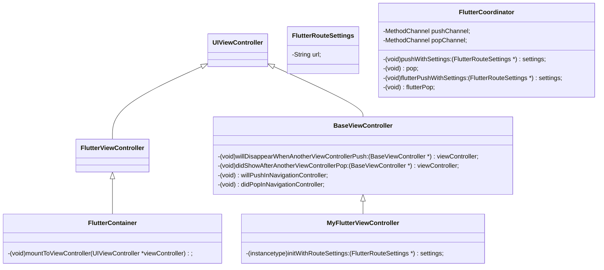

本文主要以iOS视角叙述，Android换汤不换药。

## 背景

Flutter目前非常火热，开发者使用Flutter编写一套代码在不同平台上的表现高度一致，并且在开发过程中可以使用Hot reload功能，这可以极大提升开发效率，在Google DevFest 2019上Flutter公布了add to App的能力，这使现有的原生项目接入Flutter成为可能。业界已经有很多公司和产品使用Flutter混合开发并且落地。

这片文章主要解决Flutter接入原生App之后资源占用过高的问题以及在此基础上如何获得一致的路由管理体验。

## Flutter接入现有App的方式

主要有两个对象：

*  [FlutterEngine](https://api.flutter.dev/objcdoc/Classes/FlutterEngine.html)

  Flutter引擎负责运行Dart代码、渲染UI、响应事件。

* [FlutterViewController](https://api.flutter.dev/objcdoc/Classes/FlutterViewController.html)

  继承自`UIViewController`，Flutter嵌入到原生的视图，与FlutterEngine协同工作。

这两个对象都比较重，尤其是FlutterEngine，官方建议使用之前先pre-warm，如果在打开第一个Flutter页面的时候再初始化会比较慢。

目前有以下几个问题：

* FlutterEngine和FlutterViewController必须一一对应

  一个引擎只能同时管理一个视图，也就是说需要有多个Flutter视图的时候就需要多个引擎。

* 多个不同的FlutterEngine内存不共享

* FlutterViewController和FlutterEngine的实现都在Flutter.framework中

  如果希望Flutter视图继承现有的某个BaseViewController以获得一些特性是做不到的。

## 引擎复用

解决资源占用过高的第一步就是实现FlutterEngine的复用，即多个FlutterViewController可以共用一个引擎。

目前业界的方案都是基于这个原则：**同时只有一个FlutterViewController会呈现**。

通过替换engine上挂载的视图就可以实现engine的重用，这样任何时候内存中只需要一个engine，哪怕有多个视图，这样可以大大减少内存占用。

⚠️**替换视图的时机很重要，如果把握不好Flutter会假死。**

## 路由管理

当App中同时有不同种类的页面（native、webview、flutter。。。）如何优雅地管理路由？

首先我们来看一个开源项目：[flutter_thrio](https://github.com/hellobike/flutter_thrio)

它实现了三端（iOS、Android、flutter）通过url统一管理路由并且复用引擎，给了我很大启发。

以push一个页面为例，这是官方的时序图：


thrio将所有的路由操作统一收拢到native侧执行，然后再由PlatformChannel发送给flutter。

图中有一些细节不是很详细，我阅读了它的源码之后自己画了个流程图：


thrio解决了engine复用和多端路由同步的问题，非常厉害，但是它需要同时维护原生和flutter两个导航器，这可能会造成些不稳定的表现，我在运行它的Demo的时候就触发过几次无法pop页面的Bug，另外一个问题就是当原生页面和flutter页面交替出现的时候thrio会连续创建多个FlutterViewController，内存消耗较大。

我们希望任何一方（native、flutter、webview。。。）**页面概念统一为原生的ViewController**，这样FlutterViewController也可以被复用，进一步节约资源。

## FlutterViewController复用

基本思路是将FlutterViewController做成单例，挂在当前显示的ViewController上。

用一张类图讲解一下：



FlutterCoordinator的作用：

* 通过PlatformChannel接收Flutter传来的路由操作并操作路由
* 通过PlatformChannel向Flutter发出路由操作的命令
* 暴露接口给MyFlutterViewContorller传递来自原生模块的路由操作给Flutter
* 持有FlutterEngine
* 其他原生模块和Flutter的交互经过FlutterCoordinator传递

FlutterContainer的作用：

* 集成自FlutterViewController可以配合引擎实现Flutter的功能
* 单例模式保证只有一个FlutterViewController
* `mountToViewController`可以将Flutter挂载到不同的ViewController上，实现FlutterViewController的复用

FlutterRouteSettings：存放flutter路由跳转时的信息。

MyFlutterViewController的作用：

* 作为包裹FlutterViewController的容器，同时也是页面概念的基本单位
* 集成自BaseViewController让Flutter页面也可以拥有基类的特性
* 通过声明周期控制FlutterContainer的挂载

复用FlutterViewController确实能节省很多资源，但是有一个问题：Flutter只能挂载在一个页面，页面切换过程会很奇怪。

这个问题我通过一个“障眼法”来解决：当flutter页面之上有一个新的页面push进路由栈的时候将这个flutter页面截图并显示出来，这样即使flutter从这个页面卸载，在页面切换过程中看到的也是之前flutter显示的内容；当pop到该页面时先挂载flutter然后再将截图销毁。

为了实现这个“障眼法”我从BaseViewController中派生出了多个生命周期回调来确定合适的挂载、替换时机。

```objc
- (void)willDisappearWhenAnotherViewControllerPush:(BaseViewController *)viewController {
    // 切换成截图
    _screenShotView = [[UIImageView alloc]
        initWithImage:[UIImage qmui_imageWithView:[XWFlutterContainer sharedInstance].view afterScreenUpdates:NO]];
    _screenShotView.frame = CGRectMake(0, 0, SCREEN_WIDTH, SCREEN_HEIGHT);
    [self.view addSubview:_screenShotView];
}

- (void)didShowAfterAnotherViewControllerPop:(BaseViewController *)viewController {
    [[FlutterContainer sharedInstance] mountToViewController:self];

    // 卸载截图
    if (_screenShotView) {
        [self.view bringSubviewToFront:_screenShotView];
        // 给flutter挂载和切换路由的时间
        QHDispatchDelayMain(.1, ^{
            [self.screenShotView removeFromSuperview];
            self.screenShotView = nil;
        });
    }
}

- (void)willPushInNavigationController {
    // 延迟0.01秒挂载可以避免flutter无响应的问题
    QHDispatchDelayMain(.01, ^{
        [FlutterShared pushWithSettings:self.settings];
        [[FlutterContainer sharedInstance] mountToViewController:self];
    });
}

- (void)didPopInNavigationController {
    [FlutterShared pop];
}
```

这的处理其实还是比较粗糙，Flutter的挂载时机还需要更细致的研究，最好的情况是Flutter完成路由变换之后能回调原生。

## 参考资料

* [Add Flutter to existing app](https://flutter.dev/docs/development/add-to-app)
* [已开源|码上用它开始Flutter混合开发——FlutterBoost](https://mp.weixin.qq.com/s?__biz=MzU4MDUxOTI5NA==&mid=2247484367&idx=1&sn=fcbc485f068dae5de9f68d52607ea08f&chksm=fd54d7deca235ec86249a9e3714ec18be8b2d6dc580cae19e4e5113533a6c5b44dfa5813c4c3&scene=0&subscene=131&clicktime=1551942425&ascene=7&devicetype=android-28&version=2700033b&nettype=ctnet&abtest_cookie=BAABAAoACwASABMABAAklx4AVpkeAMSZHgDWmR4AAAA%3D&lang=zh_CN&pass_ticket=1qvHqOsbLBHv3wwAcw577EHhNjg6EKXqTfnOiFbbbaw%3D&wx_header=1)
* [即将开源 | 让Flutter真正支持View级别的混合开发](https://mp.weixin.qq.com/s/-vyU1JQzdGLUmLGHRImIvg)

* [如何将 Flutter 无缝的接入现有应用](https://github.com/hellobike/flutter_thrio/blob/master/doc/Feature.md)